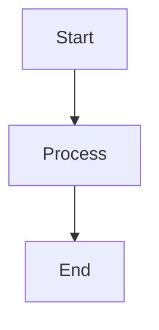
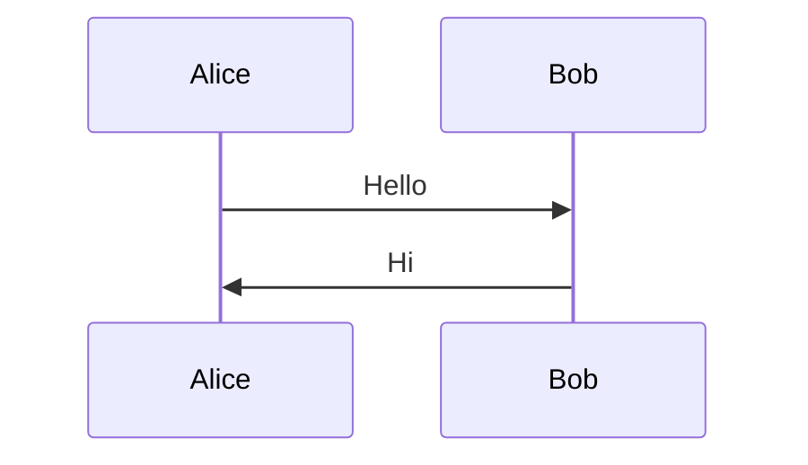

> This document demonstrates most common Markdown features and many extended features supported by modern Markdown renderers.

---

This is some <mark>highlighted text</mark>, i really hope you enjoy it!


# Heading 1

## Heading 2

### Heading 3

#### Heading 4

##### Heading 5

###### Heading 6

---

## Paragraphs

This is a normal paragraph.

This is another paragraph separated by a blank line.

Markdown automatically wraps text within a paragraph.

---

## Text Formatting
`this is some code`
**Bold**

*Italic*

***Bold and Italic***

~~Strikethrough~~

`Inline code`

<u>HTML Underline</u>

<mark>Highlighted Text</mark>

Superscript: X<sup>2</sup>

Subscript: H<sub>2</sub>O

---

## Blockquotes

> Simple blockquote

> Multi-line blockquote
>
> Second line
>
> Third line

> Nested blockquote
>
> > Level 2
> >
> > > Level 3

---

## Lists

### Unordered List

- Item 1
- Item 2
- Item 3

### Nested Unordered List

- Parent
  - Child
    - Grandchild

### Ordered List

1. First
2. Second
3. Third

### Nested Ordered List

1. Parent
   1. Child
   2. Child
2. Parent

### Mixed List

1. Item
   - Sub-item
   - Sub-item
2. Item

---

## Task Lists

- [x] Completed task
- [ ] Incomplete task
- [x] Another completed task

---

## Horizontal Rules

---

***

___

---

## Links

Inline link:

[OpenAI](https://www.openai.com)

Reference link:

[GitHub][github]

[github]: https://github.com

Automatic URL:

https://example.com

Email:

<test@example.com>

---

## Images


Linked image:

[](https://example.com)

---

## Inline HTML

<div>
    <strong>HTML Block</strong>
</div>

<table>
<tr>
<td>HTML Table Cell</td>
<td>Another Cell</td>
</tr>
</table>

---

## Code Blocks

### Fenced Code Block

```python
def hello():
    print("Hello, World!")
```

### JSON

```json
{
    "name": "Markdown",
    "version": 1
}
```

### C++

```cpp
#include <iostream>

int main() {
    std::cout << "Hello";
}
```

### Bash

```bash
echo "Hello World"
```

### Plain Text

```text
This is plain text.
```

---

## Indented Code Block
```css
    This is an indented code block.
    Line 2.
    Line 3.
```
---

## Testing

#123

:smile:

:call_me:

Hello, world! :rofl:

(tm)

<-->

`<-->`

## Tables

| Name | Age | City |
|------|-----|------|
| ==Alice== | 25 | Perth |
| Bob | 30 | Sydney |
| Charlie | 35 | Melbourne |

### Alignment

| Left | Center | Right |
|:------|:------:|------:|
| A | B | C |
| 1 | 2 | 3 |

---

## Escaping Characters

\*Not italic\*

\# Not a heading

\`Not code\`

\[Not a link\]

---

## Footnotes

This sentence contains a footnote.[^1]

Another footnote.[^long]

[^1]: Simple footnote.

[^long]: This is a longer footnote that spans multiple lines and demonstrates extended markdown support.

---

## Definition Lists

Term 1
: Definition 1

Term 2
: Definition 2

---

## Emoji

:smile:

😀 😎 🚀

---

## Mathematics (if supported)

Inline math:

$E = mc^2$

Block math:

$$
\int_0^\infty e^{-x} dx = 1
$$

Matrix:

$$
\begin{bmatrix}
1 & 2 \\
3 & 4
\end{bmatrix}
$$

---

## Mermaid Diagrams (if supported)





---

## Collapsible Sections (GitHub)

<details>
<summary>Click to expand</summary>

Hidden content inside details tag.

- Item 1
- Item 2

</details>

---

## Keyboard Keys

++ctrl+k++

<kbd>Ctrl</kbd> + <kbd>Shift</kbd> + <kbd>P</kbd>

---

## Abbreviations

HTML

*[HTML]: HyperText Markup Language

---

## Nested Formatting

***Bold Italic***

~~**Bold Strikethrough**~~

**`Bold Code`**

*`Italic Code`*

---

## Line Breaks

Line one.  
Line two (hard break).

Line three.

---

## Quotes and Code

> Use the command:
>
> ```bash
> npm install
> ```

---

## Large Table

| ID | Name | Value | Status |
|----|------|--------|--------|
| 1 | Test | 100 | Active |
| 2 | Test | 200 | Active |
| 3 | Test | 300 | Disabled |
| 4 | Test | 400 | Pending |
| 5 | Test | 500 | Active |

---

## Embedded SVG

<svg width="100" height="100">
    <circle cx="50" cy="50" r="40" stroke="black" fill="lightblue"/>
</svg>

---

## Raw HTML Form

<form>
    <input type="text" placeholder="Text field">
    <button>Submit</button>
</form>

---

## Entity Characters

&copy;

&reg;

&trade;

&nbsp;

---

## End of Document

If your Markdown renderer supports:

- CommonMark
- GitHub Flavored Markdown
- HTML embedding
- MathJax/KaTeX
- Mermaid
- Footnotes
- Task lists
- Tables

then every section above should render correctly.